# Linux / Docker / Git 기초 학습

## 1. 프로젝트 개요

리눅스 터미널 기본 명령어, 파일 권한, Docker 컨테이너 운영,
Dockerfile 기반 커스텀 이미지 생성, Git/GitHub 연동까지
DevOps 기초 역량을 실습하고 기록한 저장소입니다.

---

## 2. 실행 환경

| 항목 | 버전 / 정보 |
|------|-------------|
| OS | `macOS 26.3.1` |
| Shell | `zsh` |
| Terminal | `기본 터미널` |
| Docker | `Docker version 29.3.0, build 5927d80` |
| Docker Compose | `Docker Compose version v5.1.0` |
| Git | `git version 2.50.1 (Apple Git-155)` |

```bash
# 환경 확인 명령어
sw_vers                # macOS 버전
echo $SHELL            # 쉘 확인
docker --version       # Docker 버전
git --version          # Git 버전
```

---

## 3. 수행 항목 체크리스트

### 3-1. 터미널 기본 명령어

| 완료 | 항목 | 핵심 명령어 |
|:----:|------|------------|
| [x] | 현재 위치 확인 | `pwd` |
| [x] | 목록 확인 (숨김 파일 포함) | `ls -al` |
| [x] | 디렉터리 이동 | `cd 절대경로`, `cd ./상대경로` |
| [x] | 디렉터리 생성 | `mkdir -p a/b/c` |
| [x] | 파일/디렉터리 복사 | `cp`, `cp -r` |
| [x] | 이동 / 이름 변경 | `mv` |
| [x] | 삭제 | `rm`, `rm -rf` |
| [x] | 파일 내용 확인 | `cat`, `head`, `tail`, `less` |
| [x] | 빈 파일 생성 | `touch` |

### 3-2. 파일 권한

| 완료 | 항목 | 핵심 명령어 |
|:----:|------|------------|
| [x] | 현재 권한 확인 | `ls -l` |
| [x] | 파일 권한 변경 (숫자) | `chmod 755 파일명` |
| [x] | 파일 권한 변경 (문자) | `chmod u+x 파일명` |
| [x] | 디렉터리 권한 변경 | `chmod -R 755 디렉터리명` |

### 3-3. Docker 설치 및 기본 점검

| 완료 | 항목 | 핵심 명령어 |
|:----:|------|------------|
| [x] | Docker 버전 확인 | `docker --version` |
| [x] | Docker 데몬 동작 확인 | `docker info` |

### 3-4. Docker 기본 운영 명령

| 완료 | 항목 | 핵심 명령어 |
|:----:|------|------------|
| [x] | 이미지 다운로드 | `docker pull nginx` |
| [x] | 이미지 목록 확인 | `docker images` |
| [x] | 컨테이너 실행 | `docker run 이미지명` |
| [x] | 실행 중 컨테이너 확인 | `docker ps` |
| [x] | 전체 컨테이너 확인 | `docker ps -a` |
| [x] | 컨테이너 중지/삭제 | `docker stop`, `docker rm` |
| [x] | 컨테이너 로그 확인 | `docker logs 컨테이너ID` |
| [x] | 리소스 사용량 확인 | `docker stats` |

### 3-5. 컨테이너 실행 실습

| 완료 | 항목 | 핵심 명령어 |
|:----:|------|------------|
| [x] | hello-world 실행 | `docker run hello-world` |
| [x] | ubuntu 컨테이너 내부 진입 | `docker run -it ubuntu /bin/bash` |
| [x] | 종료/유지 차이 정리 | `exit` vs `Ctrl+P,Q` |

### 3-6. Dockerfile 기반 커스텀 이미지

| 완료 | 항목 | 설명 |
|:----:|------|------|
| [x] | 베이스 이미지 선택 | NGINX 공식 이미지 |
| [x] | 정적 콘텐츠 추가 | `COPY index.html` |
| [x] | 커스텀 이미지 빌드 | `docker build -t my-web .` |
| [x] | 커스텀 이미지 실행 | `docker run -d -p 8080:80 my-web` |

### 3-7. 포트 매핑 및 접속

| 완료 | 항목 | 핵심 명령어 |
|:----:|------|------------|
| [x] | 포트 매핑하여 실행 | `docker run -d -p 8080:80 my-web` |
| [x] | 브라우저/curl 접속 확인 | `curl http://localhost:8080` |

### 3-8. 바인드 마운트 / Docker 볼륨

| 완료 | 항목 | 핵심 명령어 |
|:----:|------|------------|
| [x] | 바인드 마운트 실행 | `docker run -v $(pwd)/html:/usr/share/nginx/html ...` |
| [x] | 호스트 파일 변경 → 컨테이너 반영 확인 | 변경 전/후 비교 |
| [x] | 볼륨 생성 | `docker volume create mydata` |
| [x] | 볼륨 연결하여 컨테이너 실행 | `docker run -v mydata:/data ...` |
| [x] | 컨테이너 삭제 후 데이터 유지 확인 | 삭제 전/후 비교 |

### 3-9. Git / GitHub

| 완료 | 항목 | 핵심 명령어 |
|:----:|------|------------|
| [x] | 사용자 이름/이메일 설정 | `git config --global user.name / user.email` |
| [x] | 설정 확인 | `git config --list` |
| [x] | GitHub 연동 및 push | `git remote add origin URL` → `git push` |

---

## 4. 터미널 조작 로그 및 캡쳐

### 4-1. 현재 위치 확인 

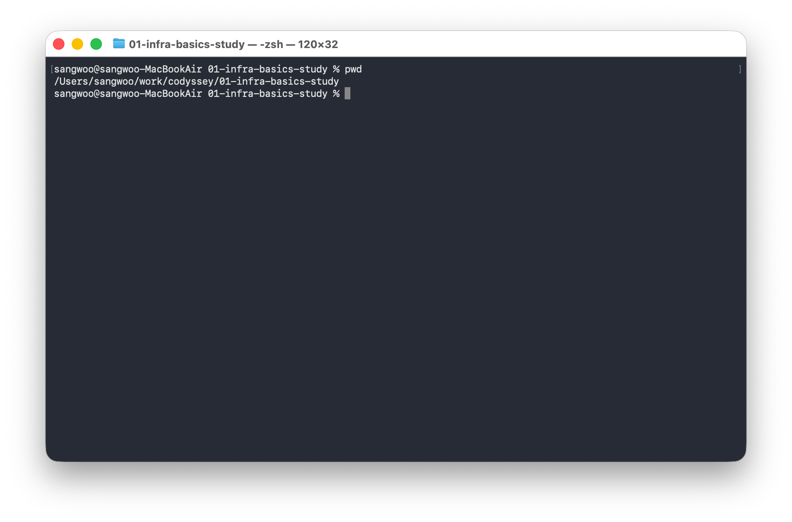

```bash
sangwoo@sangwoo-MacBookAir 01-infra-basics-study % pwd
/Users/sangwoo/work/codyssey/01-infra-basics-study
```

### 4-2. 목록 확인 (숨김 파일 포함)

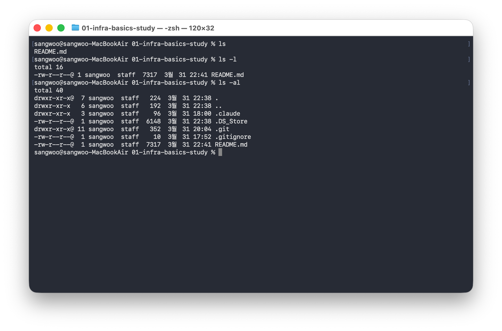

```bash
sangwoo@sangwoo-MacBookAir 01-infra-basics-study % ls
README.md
sangwoo@sangwoo-MacBookAir 01-infra-basics-study % ls -l
total 16
-rw-r--r--@ 1 sangwoo  staff  6308  3월 31 22:33 README.md
sangwoo@sangwoo-MacBookAir 01-infra-basics-study % ls -al
total 40
drwxr-xr-x@  7 sangwoo  staff   224  3월 31 22:38 .
drwxr-xr-x   6 sangwoo  staff   192  3월 31 22:38 ..
drwxr-xr-x   3 sangwoo  staff    96  3월 31 18:00 .claude
-rw-r--r--@  1 sangwoo  staff  6148  3월 31 22:38 .DS_Store
drwxr-xr-x@ 11 sangwoo  staff   352  3월 31 20:04 .git
-rw-r--r--@  1 sangwoo  staff    10  3월 31 17:52 .gitignore
-rw-r--r--@  1 sangwoo  staff  6308  3월 31 22:33 README.md
```

> **숨김 파일**: `.`으로 시작하는 파일/디렉터리 (예: `.git`)는 `-a` 옵션 없이는 표시되지 않는다.

### 4-3. 디렉터리 이동

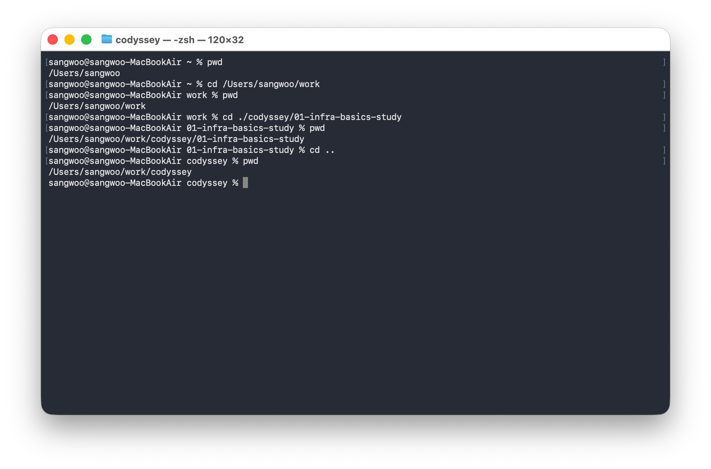

```bash
sangwoo@sangwoo-MacBookAir ~ % pwd
/Users/sangwoo
sangwoo@sangwoo-MacBookAir ~ % cd /Users/sangwoo/work 
sangwoo@sangwoo-MacBookAir work % pwd
/Users/sangwoo/work
sangwoo@sangwoo-MacBookAir work % cd ./codyssey/01-infra-basics-study 
sangwoo@sangwoo-MacBookAir 01-infra-basics-study % pwd
/Users/sangwoo/work/codyssey/01-infra-basics-study
sangwoo@sangwoo-MacBookAir 01-infra-basics-study % cd ..
sangwoo@sangwoo-MacBookAir codyssey % pwd
/Users/sangwoo/work/codyssey
sangwoo@sangwoo-MacBookAir codyssey % 
```

> **절대 경로 vs 상대 경로**
> - 절대 경로: `/`(루트)부터 시작하는 전체 경로. 현재 위치와 무관하게 항상 동일한 위치를 가리킨다.
> - 상대 경로: 현재 위치(`.`)를 기준으로 한 경로. `./src`, `../config` 등으로 표기한다.

### 4-4. 디렉터리 생성

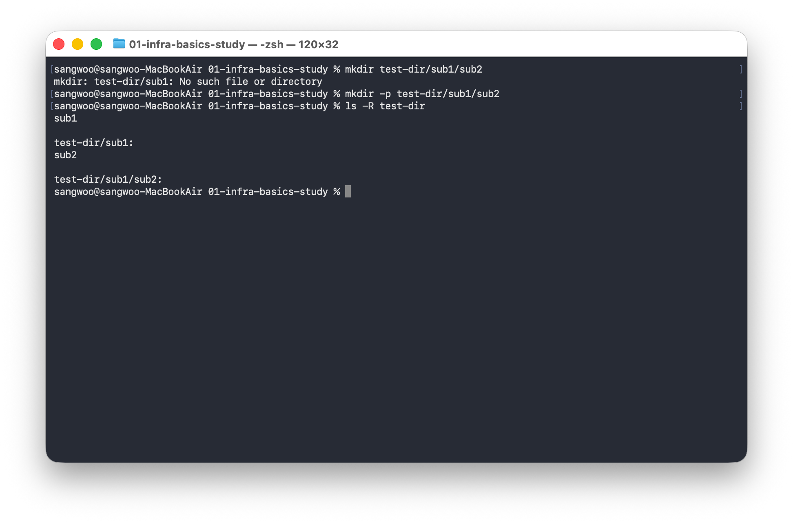

```bash
sangwoo@sangwoo-MacBookAir 01-infra-basics-study % mkdir test-dir/sub1/sub2
mkdir: test-dir/sub1: No such file or directory
sangwoo@sangwoo-MacBookAir 01-infra-basics-study % mkdir -p test-dir/sub1/sub2
sangwoo@sangwoo-MacBookAir 01-infra-basics-study % ls -R test-dir
sub1

test-dir/sub1:
sub2

test-dir/sub1/sub2:
```

### 4-5. 파일/디렉터리 복사

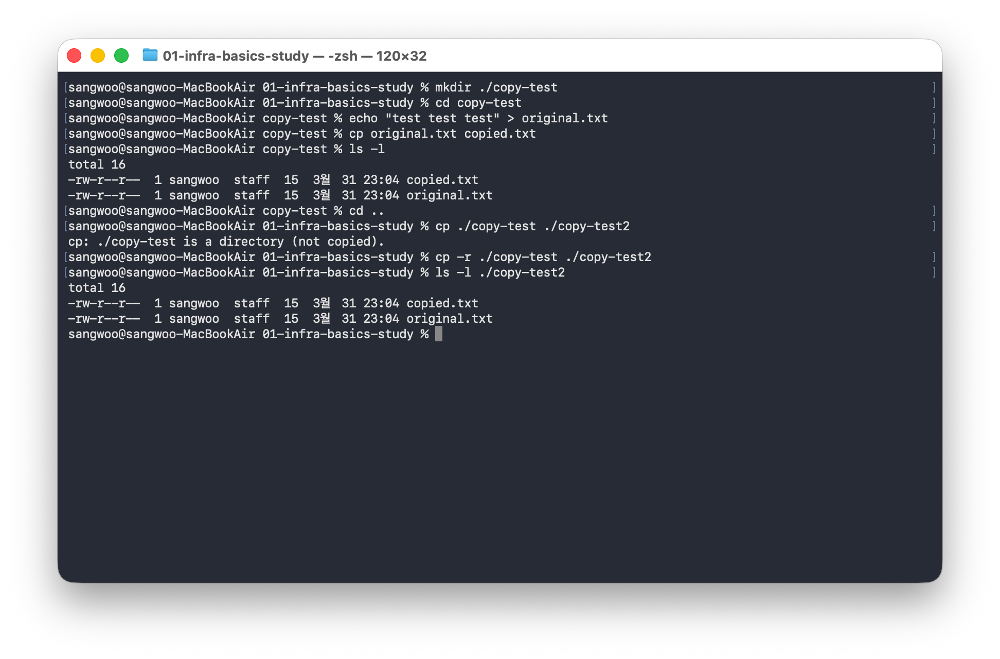

```bash
sangwoo@sangwoo-MacBookAir 01-infra-basics-study % mkdir ./copy-test
sangwoo@sangwoo-MacBookAir 01-infra-basics-study % cd copy-test 
sangwoo@sangwoo-MacBookAir copy-test % echo "test test test" > original.txt
sangwoo@sangwoo-MacBookAir copy-test % cp original.txt copied.txt
sangwoo@sangwoo-MacBookAir copy-test % ls -l
total 16
-rw-r--r--  1 sangwoo  staff  15  3월 31 23:04 copied.txt
-rw-r--r--  1 sangwoo  staff  15  3월 31 23:04 original.txt
sangwoo@sangwoo-MacBookAir copy-test % cd ..
sangwoo@sangwoo-MacBookAir 01-infra-basics-study % cp ./copy-test ./copy-test2
cp: ./copy-test is a directory (not copied).
sangwoo@sangwoo-MacBookAir 01-infra-basics-study % cp -r ./copy-test ./copy-test2
sangwoo@sangwoo-MacBookAir 01-infra-basics-study % ls -l ./copy-test2
total 16
-rw-r--r--  1 sangwoo  staff  15  3월 31 23:04 copied.txt
-rw-r--r--  1 sangwoo  staff  15  3월 31 23:04 original.txt
```

### 4-6. 이동 / 이름 변경

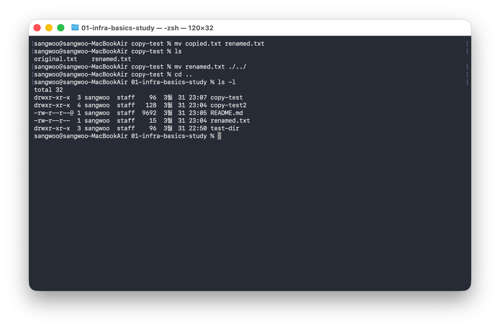

```bash
sangwoo@sangwoo-MacBookAir copy-test % mv copied.txt renamed.txt
sangwoo@sangwoo-MacBookAir copy-test % ls  
original.txt	renamed.txt
sangwoo@sangwoo-MacBookAir copy-test % mv renamed.txt ./../          
sangwoo@sangwoo-MacBookAir copy-test % cd ..
sangwoo@sangwoo-MacBookAir 01-infra-basics-study % ls -l 
total 32
drwxr-xr-x  3 sangwoo  staff    96  3월 31 23:07 copy-test
drwxr-xr-x  4 sangwoo  staff   128  3월 31 23:04 copy-test2
-rw-r--r--@ 1 sangwoo  staff  9692  3월 31 23:05 README.md
-rw-r--r--  1 sangwoo  staff    15  3월 31 23:04 renamed.txt
drwxr-xr-x  3 sangwoo  staff    96  3월 31 22:50 test-dir
```

### 4-7. 삭제

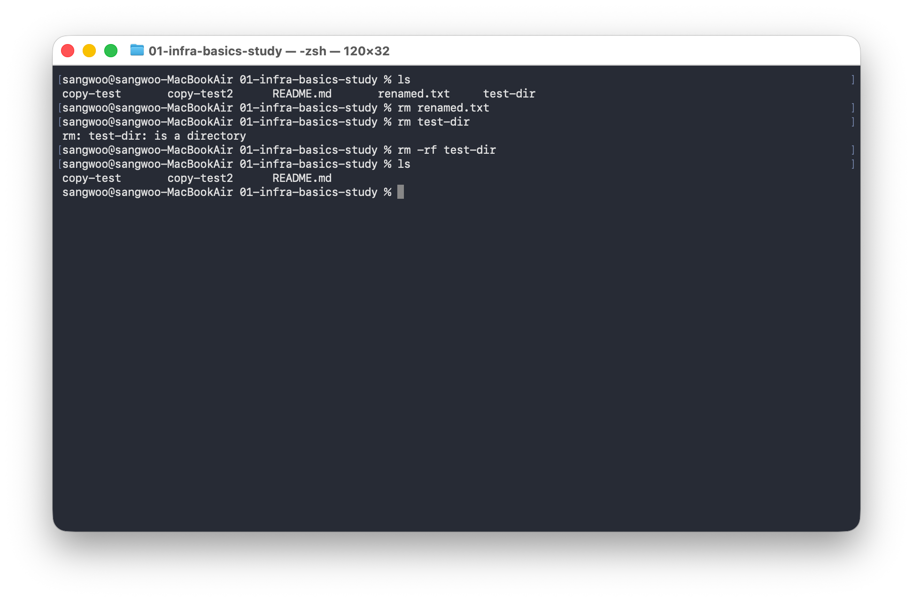

```bash
sangwoo@sangwoo-MacBookAir 01-infra-basics-study % ls
copy-test	copy-test2	README.md	renamed.txt	test-dir
sangwoo@sangwoo-MacBookAir 01-infra-basics-study % rm renamed.txt 
sangwoo@sangwoo-MacBookAir 01-infra-basics-study % rm test-dir 
rm: test-dir: is a directory
sangwoo@sangwoo-MacBookAir 01-infra-basics-study % rm -rf test-dir 
sangwoo@sangwoo-MacBookAir 01-infra-basics-study % ls
copy-test	copy-test2	README.md
```

### 4-8. 파일 내용 확인

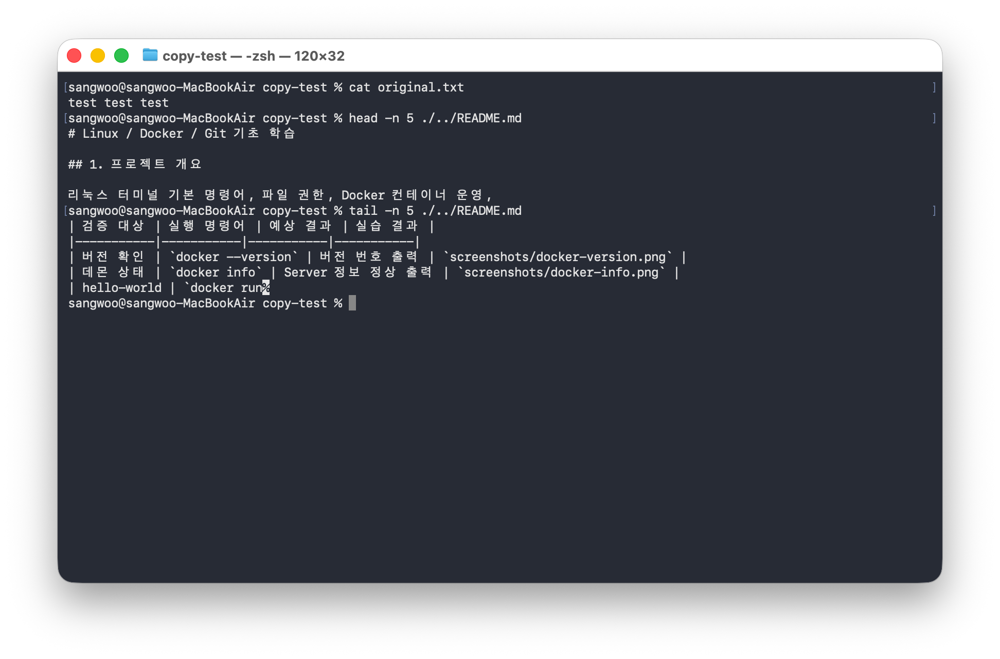
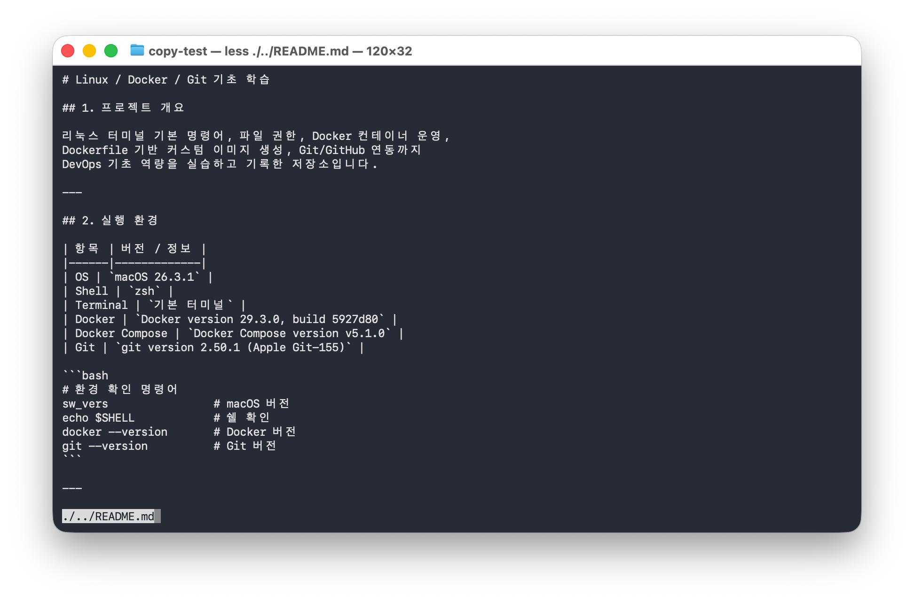

```bash
sangwoo@sangwoo-MacBookAir copy-test % cat original.txt 
test test test
sangwoo@sangwoo-MacBookAir copy-test % head -n 5 ./../README.md 
# Linux / Docker / Git 기초 학습

## 1. 프로젝트 개요

리눅스 터미널 기본 명령어, 파일 권한, Docker 컨테이너 운영,
sangwoo@sangwoo-MacBookAir copy-test % tail -n 5 ./../README.md 
| 검증 대상 | 실행 명령어 | 예상 결과 | 실습 결과 |
|-----------|-----------|-----------|-----------|
| 버전 확인 | `docker --version` | 버전 번호 출력 | `screenshots/docker-version.png` |
| 데몬 상태 | `docker info` | Server 정보 정상 출력 | `screenshots/docker-info.png` |
| hello-world | `docker run%                                                                                            
```

### 4-9. 빈 파일 생성

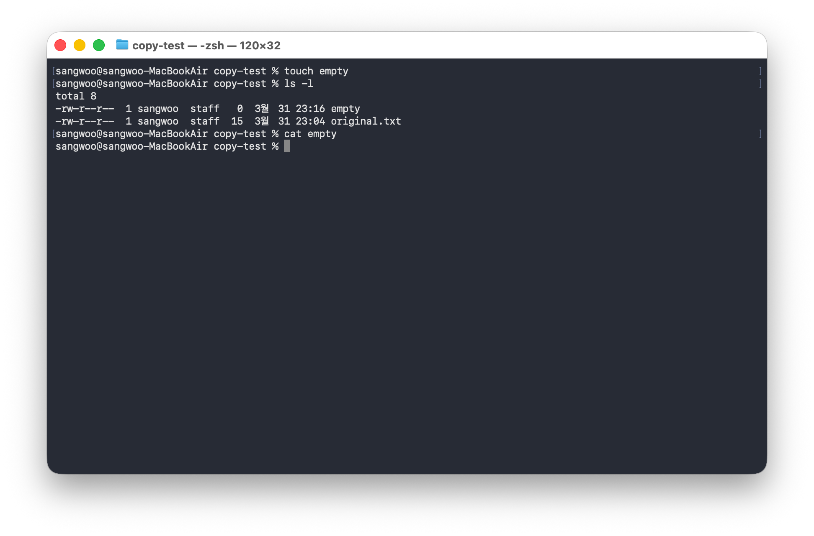

```bash
sangwoo@sangwoo-MacBookAir copy-test % touch empty 
sangwoo@sangwoo-MacBookAir copy-test % ls -l
total 8
-rw-r--r--  1 sangwoo  staff   0  3월 31 23:16 empty
-rw-r--r--  1 sangwoo  staff  15  3월 31 23:04 original.txt
sangwoo@sangwoo-MacBookAir copy-test % cat empty 
```

## 5. 권한 실습

### 5-1. 파일 권한 확인 및 변경

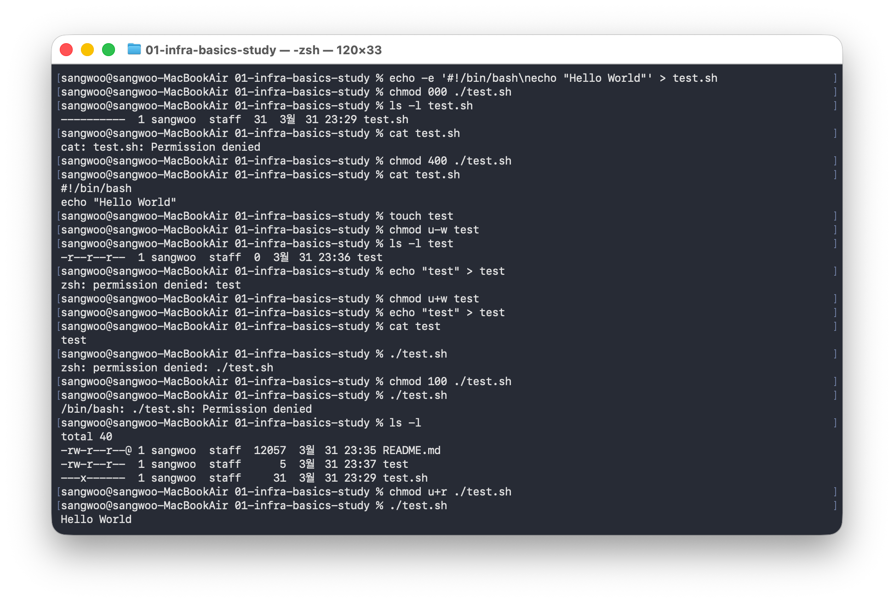

**권한 표기법:**

```
r(읽기) = 4    w(쓰기) = 2    x(실행) = 1

예) 755 → 소유자: rwx(7), 그룹: r-x(5), 기타: r-x(5)
예) 644 → 소유자: rw-(6), 그룹: r--(4), 기타: r--(4)
```

**파일 권한 변경 실험:**

```bash
# 파일 생성
sangwoo@sangwoo-MacBookAir 01-infra-basics-study % echo -e '#!/bin/bash\necho "Hello World"' > test.sh
# 테스트를 위한 기본 권한 제거
sangwoo@sangwoo-MacBookAir 01-infra-basics-study % chmod 000 ./test.sh 
sangwoo@sangwoo-MacBookAir 01-infra-basics-study % ls -l test.sh 
----------  1 sangwoo  staff  31  3월 31 23:29 test.sh

# 읽기 권한 없을때
sangwoo@sangwoo-MacBookAir 01-infra-basics-study % cat test.sh 
cat: test.sh: Permission denied
# 읽기 권한 부여
sangwoo@sangwoo-MacBookAir 01-infra-basics-study % chmod 400 ./test.sh 
# 읽기 재시도
sangwoo@sangwoo-MacBookAir 01-infra-basics-study % cat test.sh 
#!/bin/bash
echo "Hello World"
# 테스트를 위한 빈파일 생성
sangwoo@sangwoo-MacBookAir 01-infra-basics-study % touch test  
# 쓰기 권한 제거
sangwoo@sangwoo-MacBookAir 01-infra-basics-study % chmod u-w test 
# 권한 확인
sangwoo@sangwoo-MacBookAir 01-infra-basics-study % ls -l test
-r--r--r--  1 sangwoo  staff  0  3월 31 23:36 test
# 쓰기 실행
sangwoo@sangwoo-MacBookAir 01-infra-basics-study % echo "test" > test    
zsh: permission denied: test
# 쓰기 권한 추가
sangwoo@sangwoo-MacBookAir 01-infra-basics-study % chmod u+w test
# 쓰기
sangwoo@sangwoo-MacBookAir 01-infra-basics-study % echo "test" > test
sangwoo@sangwoo-MacBookAir 01-infra-basics-study % cat test
test
# 실행 테스트
sangwoo@sangwoo-MacBookAir 01-infra-basics-study % ./test.sh
zsh: permission denied: ./test.sh
# 실행권한만 부여
sangwoo@sangwoo-MacBookAir 01-infra-basics-study % chmod 100 ./test.sh
# 실행 테스트
sangwoo@sangwoo-MacBookAir 01-infra-basics-study % ./test.sh 
/bin/bash: ./test.sh: Permission denied
sangwoo@sangwoo-MacBookAir 01-infra-basics-study % ls -l
total 40
-rw-r--r--@ 1 sangwoo  staff  12057  3월 31 23:35 README.md
-rw-r--r--  1 sangwoo  staff      5  3월 31 23:37 test
---x------  1 sangwoo  staff     31  3월 31 23:29 test.sh
# 읽기 권한 추가
sangwoo@sangwoo-MacBookAir 01-infra-basics-study % chmod u+r ./test.sh
# 실행 테스트
sangwoo@sangwoo-MacBookAir 01-infra-basics-study % ./test.sh 
Hello World
```

### 5-2. 디렉터리 권한 변경

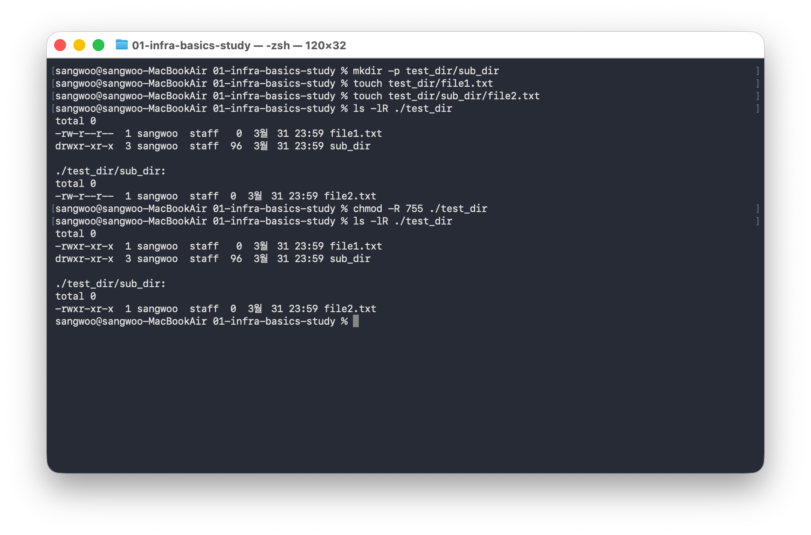

```bash
sangwoo@sangwoo-MacBookAir 01-infra-basics-study % mkdir -p test_dir/sub_dir
sangwoo@sangwoo-MacBookAir 01-infra-basics-study % touch test_dir/file1.txt
sangwoo@sangwoo-MacBookAir 01-infra-basics-study % touch test_dir/sub_dir/file2.txt
sangwoo@sangwoo-MacBookAir 01-infra-basics-study % ls -lR ./test_dir 
total 0
-rw-r--r--  1 sangwoo  staff   0  3월 31 23:59 file1.txt
drwxr-xr-x  3 sangwoo  staff  96  3월 31 23:59 sub_dir

./test_dir/sub_dir:
total 0
-rw-r--r--  1 sangwoo  staff  0  3월 31 23:59 file2.txt
sangwoo@sangwoo-MacBookAir 01-infra-basics-study % chmod -R 755 ./test_dir 
sangwoo@sangwoo-MacBookAir 01-infra-basics-study % ls -lR ./test_dir      
total 0
-rwxr-xr-x  1 sangwoo  staff   0  3월 31 23:59 file1.txt
drwxr-xr-x  3 sangwoo  staff  96  3월 31 23:59 sub_dir

./test_dir/sub_dir:
total 0
-rwxr-xr-x  1 sangwoo  staff  0  3월 31 23:59 file2.txt
```

---

## 6. Docker 설치 및 기본 점검

### 6-1. Docker 버전 확인


```bash
sangwoo@sangwoo-MacBookAir 01-infra-basics-study % docker --version
Docker version 29.3.0, build 5927d80
```

### 6-2. Docker 데몬 동작 확인

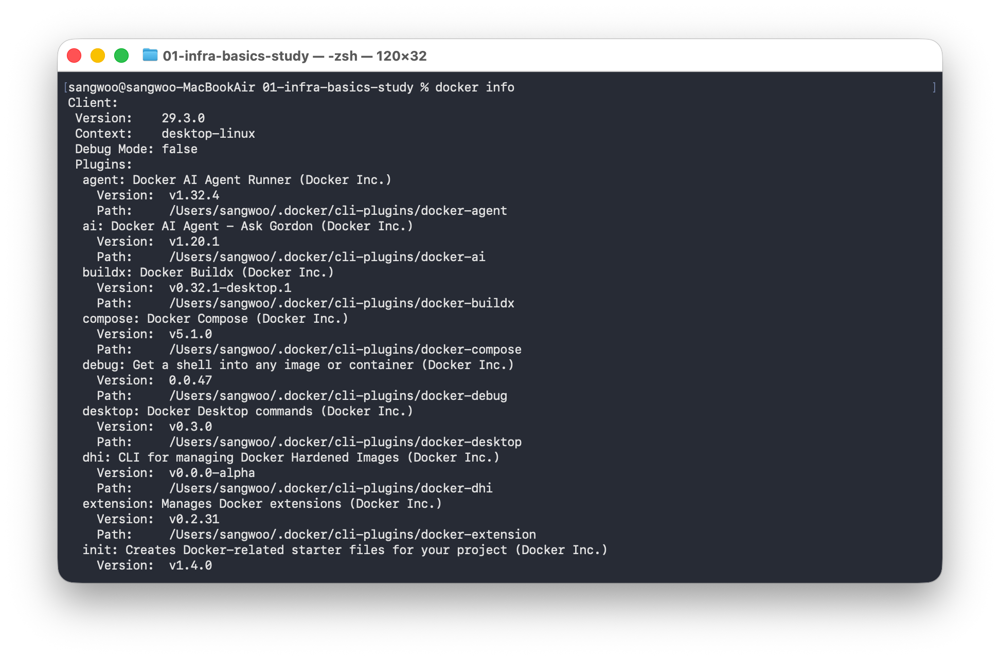

```bash
$ docker info
Client:
 Version:    27.x.x
 Context:    orbstack
 ...

Server:
 Containers: 0
  Running: 0
  Paused: 0
  Stopped: 0
 Images: 0
 Server Version: 27.x.x
 Storage Driver: overlay2
 ...
```

---

## 7. Docker 기본 운영 명령

### 7-1. 이미지 관련

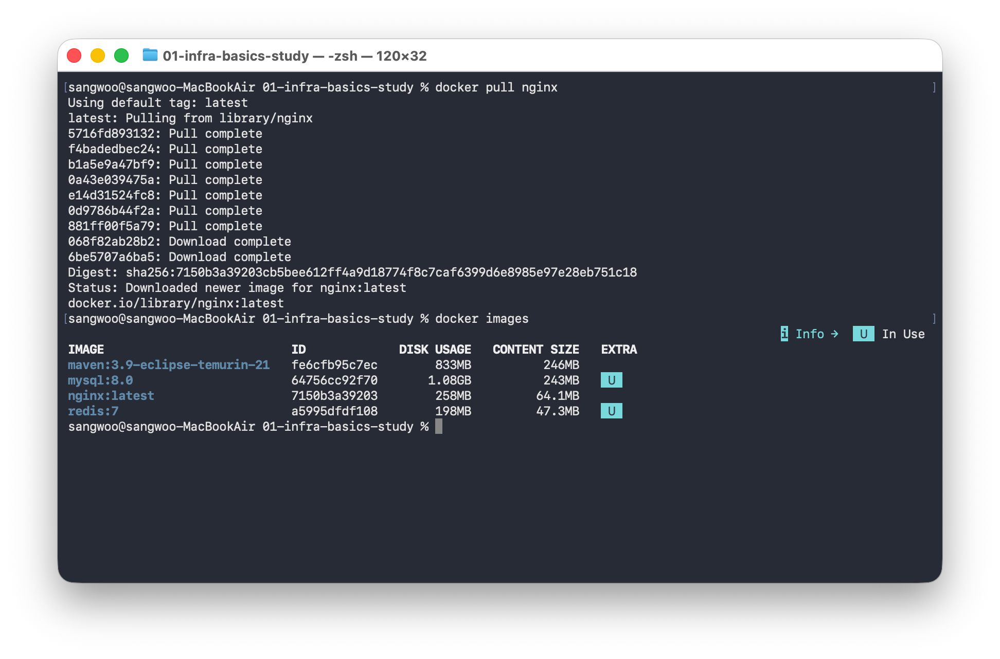

```bash
sangwoo@sangwoo-MacBookAir 01-infra-basics-study % docker pull nginx
Using default tag: latest
latest: Pulling from library/nginx
5716fd893132: Pull complete 
f4badedbec24: Pull complete 
b1a5e9a47bf9: Pull complete 
0a43e039475a: Pull complete 
e14d31524fc8: Pull complete 
0d9786b44f2a: Pull complete 
881ff00f5a79: Pull complete 
068f82ab28b2: Download complete 
6be5707a6ba5: Download complete 
Digest: sha256:7150b3a39203cb5bee612ff4a9d18774f8c7caf6399d6e8985e97e28eb751c18
Status: Downloaded newer image for nginx:latest
docker.io/library/nginx:latest
sangwoo@sangwoo-MacBookAir 01-infra-basics-study % docker images
                                                                                                   i Info →   U  In Use
IMAGE                          ID             DISK USAGE   CONTENT SIZE   EXTRA
maven:3.9-eclipse-temurin-21   fe6cfb95c7ec        833MB          246MB        
mysql:8.0                      64756cc92f70       1.08GB          243MB    U   
nginx:latest                   7150b3a39203        258MB         64.1MB        
redis:7                        a5995dfdf108        198MB         47.3MB    U  
```

### 7-2. 컨테이너 실행 / 확인 / 중지 / 삭제

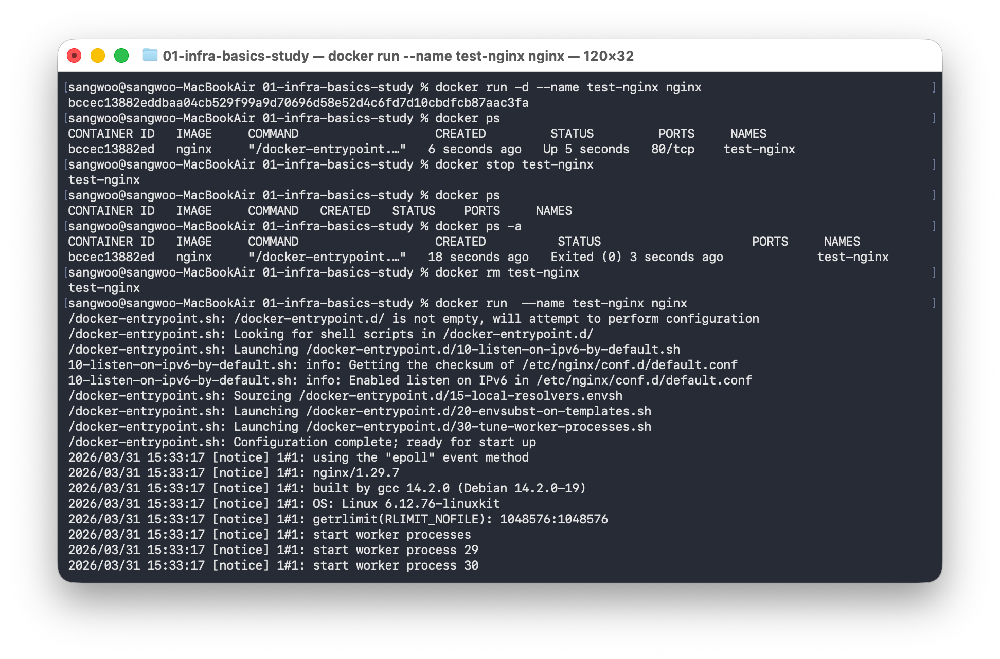

```bash
# 컨테이너 백그라운드 실행
sangwoo@sangwoo-MacBookAir 01-infra-basics-study % docker run -d --name test-nginx nginx
bccec13882eddbaa04cb529f99a9d70696d58e52d4c6fd7d10cbdfcb87aac3fa
# 컨테이너 확인
sangwoo@sangwoo-MacBookAir 01-infra-basics-study % docker ps
CONTAINER ID   IMAGE     COMMAND                   CREATED         STATUS         PORTS     NAMES
bccec13882ed   nginx     "/docker-entrypoint.…"   6 seconds ago   Up 5 seconds   80/tcp    test-nginx
# 컨테이너 중지
sangwoo@sangwoo-MacBookAir 01-infra-basics-study % docker stop test-nginx
test-nginx
# 컨테이너 확인 - 종료되서 표시 X
sangwoo@sangwoo-MacBookAir 01-infra-basics-study % docker ps
CONTAINER ID   IMAGE     COMMAND   CREATED   STATUS    PORTS     NAMES
# 컨테이너 확인 - 종료 표시
sangwoo@sangwoo-MacBookAir 01-infra-basics-study % docker ps -a
CONTAINER ID   IMAGE     COMMAND                   CREATED          STATUS                     PORTS     NAMES
bccec13882ed   nginx     "/docker-entrypoint.…"   18 seconds ago   Exited (0) 3 seconds ago             test-nginx
# 컨테이너 삭제
sangwoo@sangwoo-MacBookAir 01-infra-basics-study % docker rm test-nginx
test-nginx
# 컨테이너 실행
sangwoo@sangwoo-MacBookAir 01-infra-basics-study % docker run  --name test-nginx nginx 
/docker-entrypoint.sh: /docker-entrypoint.d/ is not empty, will attempt to perform configuration
/docker-entrypoint.sh: Looking for shell scripts in /docker-entrypoint.d/
/docker-entrypoint.sh: Launching /docker-entrypoint.d/10-listen-on-ipv6-by-default.sh
10-listen-on-ipv6-by-default.sh: info: Getting the checksum of /etc/nginx/conf.d/default.conf
10-listen-on-ipv6-by-default.sh: info: Enabled listen on IPv6 in /etc/nginx/conf.d/default.conf
/docker-entrypoint.sh: Sourcing /docker-entrypoint.d/15-local-resolvers.envsh
/docker-entrypoint.sh: Launching /docker-entrypoint.d/20-envsubst-on-templates.sh
/docker-entrypoint.sh: Launching /docker-entrypoint.d/30-tune-worker-processes.sh
/docker-entrypoint.sh: Configuration complete; ready for start up
2026/03/31 15:33:17 [notice] 1#1: using the "epoll" event method
2026/03/31 15:33:17 [notice] 1#1: nginx/1.29.7
2026/03/31 15:33:17 [notice] 1#1: built by gcc 14.2.0 (Debian 14.2.0-19) 
2026/03/31 15:33:17 [notice] 1#1: OS: Linux 6.12.76-linuxkit
2026/03/31 15:33:17 [notice] 1#1: getrlimit(RLIMIT_NOFILE): 1048576:1048576
2026/03/31 15:33:17 [notice] 1#1: start worker processes
2026/03/31 15:33:17 [notice] 1#1: start worker process 29
2026/03/31 15:33:17 [notice] 1#1: start worker process 30
2026/03/31 15:33:17 [notice] 1#1: start worker process 31
2026/03/31 15:33:17 [notice] 1#1: start worker process 32
2026/03/31 15:33:17 [notice] 1#1: start worker process 33
2026/03/31 15:33:17 [notice] 1#1: start worker process 34
2026/03/31 15:33:17 [notice] 1#1: start worker process 35
2026/03/31 15:33:17 [notice] 1#1: start worker process 36
2026/03/31 15:33:17 [notice] 1#1: start worker process 37
2026/03/31 15:33:17 [notice] 1#1: start worker process 38
2026/03/31 15:35:18 [notice] 1#1: signal 28 (SIGWINCH) received
2026/03/31 15:35:21 [notice] 1#1: signal 28 (SIGWINCH) received
2026/03/31 15:35:23 [notice] 1#1: signal 28 (SIGWINCH) received
^C2026/03/31 15:35:43 [notice] 1#1: signal 2 (SIGINT) received, exiting
2026/03/31 15:35:43 [notice] 29#29: exiting
2026/03/31 15:35:43 [notice] 30#30: exiting
2026/03/31 15:35:43 [notice] 36#36: exiting
2026/03/31 15:35:43 [notice] 30#30: exit
2026/03/31 15:35:43 [notice] 36#36: exit
2026/03/31 15:35:43 [notice] 29#29: exit
2026/03/31 15:35:43 [notice] 31#31: exiting
2026/03/31 15:35:43 [notice] 31#31: exit
2026/03/31 15:35:43 [notice] 32#32: exiting
2026/03/31 15:35:43 [notice] 32#32: exit
2026/03/31 15:35:43 [notice] 37#37: exiting
2026/03/31 15:35:43 [notice] 38#38: exiting
2026/03/31 15:35:43 [notice] 33#33: exiting
2026/03/31 15:35:43 [notice] 38#38: exit
2026/03/31 15:35:43 [notice] 37#37: exit
2026/03/31 15:35:43 [notice] 34#34: exiting
2026/03/31 15:35:43 [notice] 33#33: exit
2026/03/31 15:35:43 [notice] 34#34: exit
2026/03/31 15:35:43 [notice] 35#35: exiting
2026/03/31 15:35:43 [notice] 35#35: exit
2026/03/31 15:35:43 [notice] 1#1: signal 17 (SIGCHLD) received from 35
2026/03/31 15:35:43 [notice] 1#1: worker process 29 exited with code 0
2026/03/31 15:35:43 [notice] 1#1: worker process 30 exited with code 0
2026/03/31 15:35:43 [notice] 1#1: worker process 34 exited with code 0
2026/03/31 15:35:43 [notice] 1#1: worker process 35 exited with code 0
2026/03/31 15:35:43 [notice] 1#1: worker process 36 exited with code 0
2026/03/31 15:35:43 [notice] 1#1: signal 29 (SIGIO) received
2026/03/31 15:35:43 [notice] 1#1: signal 17 (SIGCHLD) received from 38
2026/03/31 15:35:43 [notice] 1#1: worker process 38 exited with code 0
2026/03/31 15:35:43 [notice] 1#1: signal 29 (SIGIO) received
2026/03/31 15:35:43 [notice] 1#1: signal 17 (SIGCHLD) received from 32
2026/03/31 15:35:43 [notice] 1#1: worker process 32 exited with code 0
2026/03/31 15:35:43 [notice] 1#1: worker process 33 exited with code 0
2026/03/31 15:35:43 [notice] 1#1: signal 29 (SIGIO) received
2026/03/31 15:35:43 [notice] 1#1: signal 17 (SIGCHLD) received from 31
2026/03/31 15:35:43 [notice] 1#1: worker process 31 exited with code 0
2026/03/31 15:35:43 [notice] 1#1: signal 29 (SIGIO) received
2026/03/31 15:35:43 [notice] 1#1: signal 17 (SIGCHLD) received from 37
2026/03/31 15:35:43 [notice] 1#1: worker process 37 exited with code 0
2026/03/31 15:35:43 [notice] 1#1: exit
# ctrl+c 종료 후 상태 확인
sangwoo@sangwoo-MacBookAir 01-infra-basics-study % docker ps
CONTAINER ID   IMAGE     COMMAND   CREATED   STATUS    PORTS     NAMES
```

### 7-3. 로그 및 리소스 확인

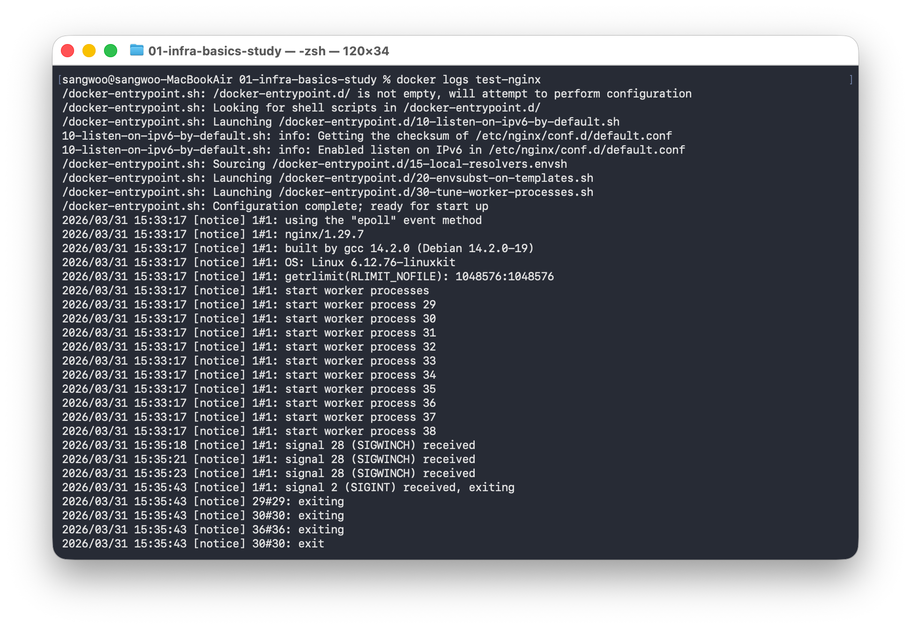
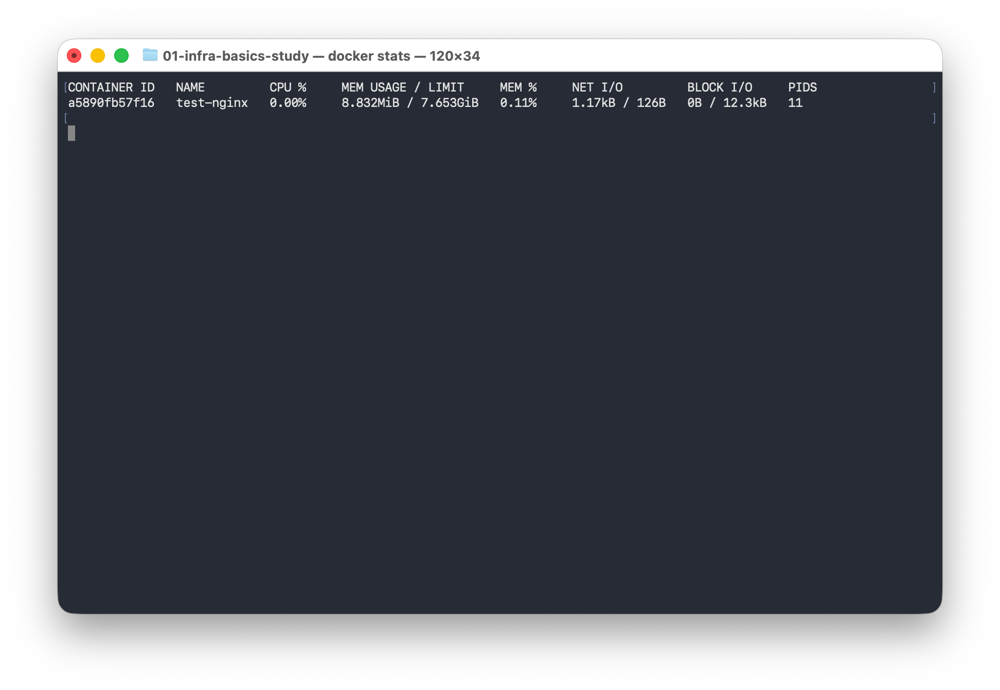


```bash
sangwoo@sangwoo-MacBookAir 01-infra-basics-study % docker run -d --name test-nginx nginx
a5890fb57f160183715f8702f3e74e8457f0f63bca7cb7974ab0927048297f37
sangwoo@sangwoo-MacBookAir 01-infra-basics-study % docker logs test-nginx               
/docker-entrypoint.sh: /docker-entrypoint.d/ is not empty, will attempt to perform configuration
/docker-entrypoint.sh: Looking for shell scripts in /docker-entrypoint.d/
/docker-entrypoint.sh: Launching /docker-entrypoint.d/10-listen-on-ipv6-by-default.sh
10-listen-on-ipv6-by-default.sh: info: Getting the checksum of /etc/nginx/conf.d/default.conf
10-listen-on-ipv6-by-default.sh: info: Enabled listen on IPv6 in /etc/nginx/conf.d/default.conf
/docker-entrypoint.sh: Sourcing /docker-entrypoint.d/15-local-resolvers.envsh
/docker-entrypoint.sh: Launching /docker-entrypoint.d/20-envsubst-on-templates.sh
/docker-entrypoint.sh: Launching /docker-entrypoint.d/30-tune-worker-processes.sh
/docker-entrypoint.sh: Configuration complete; ready for start up
2026/03/31 15:40:31 [notice] 1#1: using the "epoll" event method
2026/03/31 15:40:31 [notice] 1#1: nginx/1.29.7
2026/03/31 15:40:31 [notice] 1#1: built by gcc 14.2.0 (Debian 14.2.0-19) 
2026/03/31 15:40:31 [notice] 1#1: OS: Linux 6.12.76-linuxkit
2026/03/31 15:40:31 [notice] 1#1: getrlimit(RLIMIT_NOFILE): 1048576:1048576
2026/03/31 15:40:31 [notice] 1#1: start worker processes
2026/03/31 15:40:31 [notice] 1#1: start worker process 29
2026/03/31 15:40:31 [notice] 1#1: start worker process 30
2026/03/31 15:40:31 [notice] 1#1: start worker process 31
2026/03/31 15:40:31 [notice] 1#1: start worker process 32
2026/03/31 15:40:31 [notice] 1#1: start worker process 33
2026/03/31 15:40:31 [notice] 1#1: start worker process 34
2026/03/31 15:40:31 [notice] 1#1: start worker process 35
2026/03/31 15:40:31 [notice] 1#1: start worker process 36
2026/03/31 15:40:31 [notice] 1#1: start worker process 37
2026/03/31 15:40:31 [notice] 1#1: start worker process 38
sangwoo@sangwoo-MacBookAir 01-infra-basics-study % docker stats 
CONTAINER ID   NAME         CPU %     MEM USAGE / LIMIT     MEM %     NET I/O         BLOCK I/O     PIDS 
a5890fb57f16   test-nginx   0.00%     8.832MiB / 7.653GiB   0.11%     1.17kB / 126B   0B / 12.3kB   11 
```

---

## 8. 컨테이너 실행 실습

### 8-1. hello-world 실행

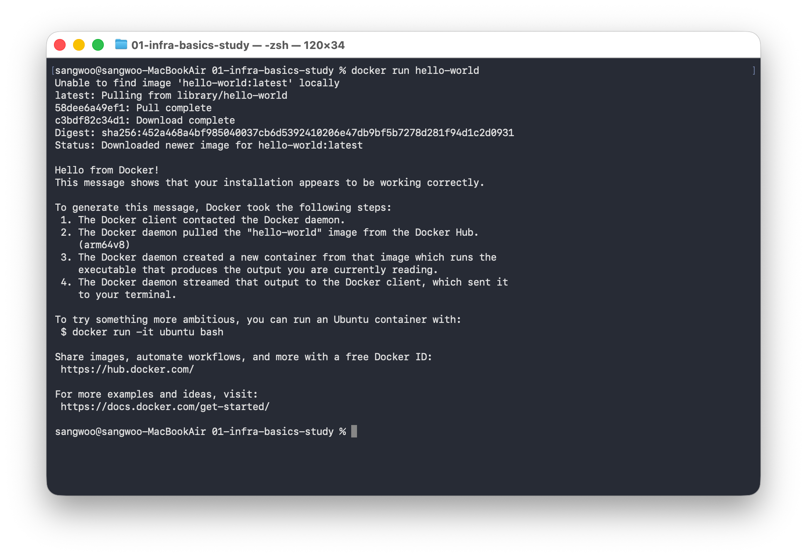

```bash
sangwoo@sangwoo-MacBookAir 01-infra-basics-study % docker run hello-world
Unable to find image 'hello-world:latest' locally
latest: Pulling from library/hello-world
58dee6a49ef1: Pull complete 
c3bdf82c34d1: Download complete 
Digest: sha256:452a468a4bf985040037cb6d5392410206e47db9bf5b7278d281f94d1c2d0931
Status: Downloaded newer image for hello-world:latest

Hello from Docker!
This message shows that your installation appears to be working correctly.

To generate this message, Docker took the following steps:
 1. The Docker client contacted the Docker daemon.
 2. The Docker daemon pulled the "hello-world" image from the Docker Hub.
    (arm64v8)
 3. The Docker daemon created a new container from that image which runs the
    executable that produces the output you are currently reading.
 4. The Docker daemon streamed that output to the Docker client, which sent it
    to your terminal.

To try something more ambitious, you can run an Ubuntu container with:
 $ docker run -it ubuntu bash

Share images, automate workflows, and more with a free Docker ID:
 https://hub.docker.com/

For more examples and ideas, visit:
 https://docs.docker.com/get-started/
```

### 8-2. Ubuntu 컨테이너 내부 진입

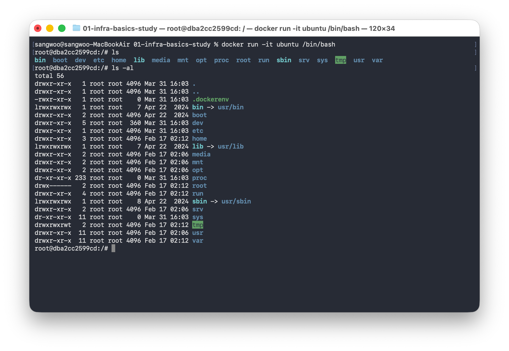


```bash
sangwoo@sangwoo-MacBookAir 01-infra-basics-study % docker run -it ubuntu /bin/bash
root@dba2cc2599cd:/# ls
bin  boot  dev  etc  home  lib  media  mnt  opt  proc  root  run  sbin  srv  sys  tmp  usr  var
root@dba2cc2599cd:/# ls -al
total 56
drwxr-xr-x   1 root root 4096 Mar 31 16:03 .
drwxr-xr-x   1 root root 4096 Mar 31 16:03 ..
-rwxr-xr-x   1 root root    0 Mar 31 16:03 .dockerenv
lrwxrwxrwx   1 root root    7 Apr 22  2024 bin -> usr/bin
drwxr-xr-x   2 root root 4096 Apr 22  2024 boot
drwxr-xr-x   5 root root  360 Mar 31 16:03 dev
drwxr-xr-x   1 root root 4096 Mar 31 16:03 etc
drwxr-xr-x   3 root root 4096 Feb 17 02:12 home
lrwxrwxrwx   1 root root    7 Apr 22  2024 lib -> usr/lib
drwxr-xr-x   2 root root 4096 Feb 17 02:06 media
drwxr-xr-x   2 root root 4096 Feb 17 02:06 mnt
drwxr-xr-x   2 root root 4096 Feb 17 02:06 opt
dr-xr-xr-x 233 root root    0 Mar 31 16:03 proc
drwx------   2 root root 4096 Feb 17 02:12 root
drwxr-xr-x   4 root root 4096 Feb 17 02:12 run
lrwxrwxrwx   1 root root    8 Apr 22  2024 sbin -> usr/sbin
drwxr-xr-x   2 root root 4096 Feb 17 02:06 srv
dr-xr-xr-x  11 root root    0 Mar 31 16:03 sys
drwxrwxrwt   2 root root 4096 Feb 17 02:12 tmp
drwxr-xr-x  11 root root 4096 Feb 17 02:06 usr
drwxr-xr-x  11 root root 4096 Feb 17 02:12 var
```

### 8-3. 컨테이너 종료/유지 차이

| 방법 | 동작 | 컨테이너 상태 |
|------|------|--------------|
| `exit` | 쉘 종료 → 컨테이너도 종료 | Exited |
| `Ctrl+P, Q` | 쉘에서 분리(detach)만 됨 | **Up (계속 실행)** |
| `docker attach 컨테이너ID` | 실행 중인 컨테이너에 다시 연결 | Up |
| `docker exec -it 컨테이너ID /bin/bash` | 새로운 쉘로 접속 (기존 프로세스 유지) | Up |

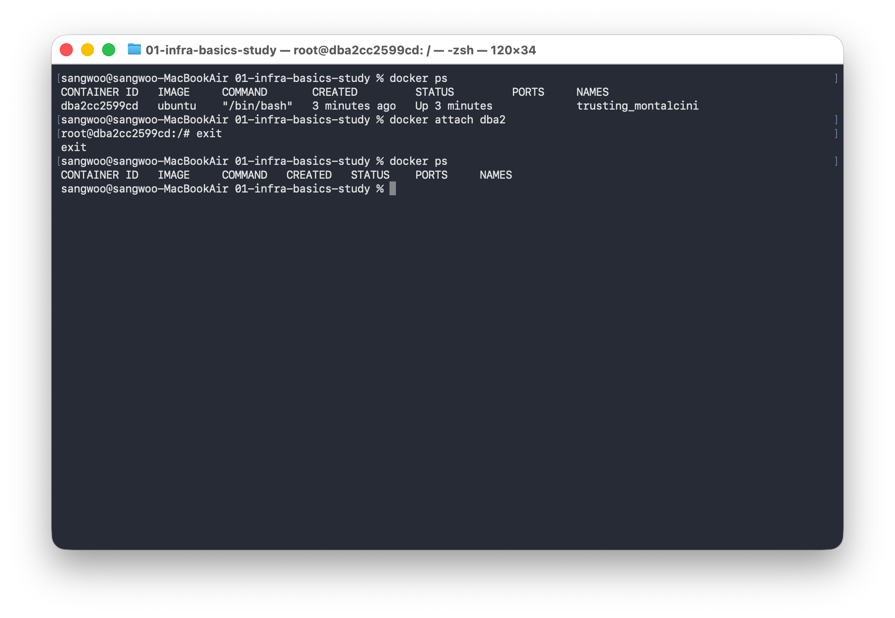

```bash
# Ctrl+P,Q로 분리한 경우
sangwoo@sangwoo-MacBookAir 01-infra-basics-study % docker ps
CONTAINER ID   IMAGE     COMMAND       CREATED         STATUS         PORTS     NAMES
dba2cc2599cd   ubuntu    "/bin/bash"   3 minutes ago   Up 3 minutes             trusting_montalcini

# 도커 재연결
sangwoo@sangwoo-MacBookAir 01-infra-basics-study % docker attach dba2
root@dba2cc2599cd:/# exit
exit
sangwoo@sangwoo-MacBookAir 01-infra-basics-study % docker ps
CONTAINER ID   IMAGE     COMMAND   CREATED   STATUS    PORTS     NAMES
```

> `exit`은 컨테이너의 메인 프로세스(PID 1)를 종료하므로 컨테이너 전체가 멈춘다.
> `Ctrl+P, Q`는 터미널 연결만 끊고 컨테이너는 백그라운드에서 계속 실행된다.

---

## 9. Dockerfile 기반 커스텀 이미지

### 9-1. 베이스 이미지 및 커스텀 포인트

| 항목 | 내용 |
|------|------|
| 베이스 이미지 | `nginx:latest` (NGINX 공식 이미지) |
| 방식 | (A) 웹 서버 베이스 + 정적 콘텐츠 교체 |

**커스텀 포인트:**

| 커스텀 항목 | 목적 |
|------------|------|
| `COPY index.html` | 기본 NGINX 환영 페이지를 직접 만든 HTML로 교체 |
| `EXPOSE 80` | 컨테이너가 80번 포트를 사용한다는 것을 명시 |

### 9-2. 프로젝트 구조

```
app/
├── Dockerfile
└── index.html
```

### 9-3. Dockerfile

```dockerfile
FROM nginx:latest

# 직접 작성한 정적 페이지를 NGINX 기본 경로에 복사
COPY index.html /usr/share/nginx/html/index.html

# 80번 포트 사용, 해당 포트 변경한다고 실제 nginx 포트 변견 X
EXPOSE 80

CMD ["nginx", "-g", "daemon off;"]
```

### 9-4. index.html

```html
sample index file
```

### 9-5. 빌드 및 실행

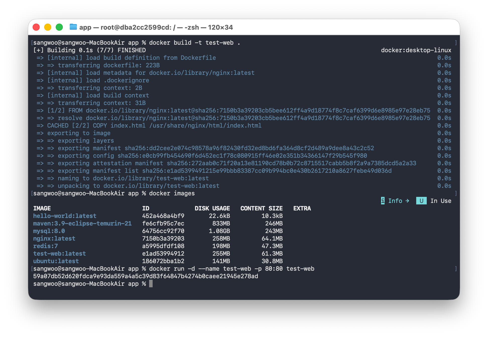

```bash
# 이미지 빌드
sangwoo@sangwoo-MacBookAir app % docker build -t test-web .
[+] Building 0.1s (7/7) FINISHED                                                                   docker:desktop-linux
 => [internal] load build definition from Dockerfile                                                               0.0s
 => => transferring dockerfile: 223B                                                                               0.0s
 => [internal] load metadata for docker.io/library/nginx:latest                                                    0.0s
 => [internal] load .dockerignore                                                                                  0.0s
 => => transferring context: 2B                                                                                    0.0s
 => [internal] load build context                                                                                  0.0s
 => => transferring context: 31B                                                                                   0.0s
 => [1/2] FROM docker.io/library/nginx:latest@sha256:7150b3a39203cb5bee612ff4a9d18774f8c7caf6399d6e8985e97e28eb75  0.0s
 => => resolve docker.io/library/nginx:latest@sha256:7150b3a39203cb5bee612ff4a9d18774f8c7caf6399d6e8985e97e28eb75  0.0s
 => CACHED [2/2] COPY index.html /usr/share/nginx/html/index.html                                                  0.0s
 => exporting to image                                                                                             0.0s
 => => exporting layers                                                                                            0.0s
 => => exporting manifest sha256:dd2cee2e074c98578a96f82430fd32ed8bd6fa364d8cf2d489a9dee8a43c2c52                  0.0s
 => => exporting config sha256:e0cb99fb454690f6d452ec1f78c080915ff46e02e351b34366147f29b545f980                    0.0s
 => => exporting attestation manifest sha256:272aab0c71f20a13e81190cd78b0b72c8715517cabb5b8f2a9a7385dcd5a2a33      0.0s
 => => exporting manifest list sha256:e1ad5399491215e99bbb83387cc09b994bc0e430b2617210a8627febe49d036d             0.0s
 => => naming to docker.io/library/test-web:latest                                                                 0.0s
 => => unpacking to docker.io/library/test-web:latest                                                              0.0s
# 빌드 결과 확인
sangwoo@sangwoo-MacBookAir app % docker images
                                                                                                   i Info →   U  In Use
IMAGE                          ID             DISK USAGE   CONTENT SIZE   EXTRA
hello-world:latest             452a468a4bf9       22.6kB         10.3kB        
maven:3.9-eclipse-temurin-21   fe6cfb95c7ec        833MB          246MB        
mysql:8.0                      64756cc92f70       1.08GB          243MB        
nginx:latest                   7150b3a39203        258MB         64.1MB        
redis:7                        a5995dfdf108        198MB         47.3MB        
test-web:latest                e1ad53994912        255MB         61.3MB        
ubuntu:latest                  186072bba1b2        141MB         30.8MB        
# 컨테이너 실행
sangwoo@sangwoo-MacBookAir app % docker run -d --name test-web -p 80:80 test-web
59a07db52d620fdca9e93da559a4a5c39d83f64847b4274b0caee21945e278ad
```

---

## 10. 포트 매핑 및 접속 증거

### 10-1. 포트 매핑이란?

컨테이너는 호스트와 격리된 네트워크 환경에서 실행된다.
`-p <호스트포트>:<컨테이너포트>`로 호스트의 포트를 컨테이너 내부 포트에 연결해야 외부에서 접근할 수 있다.

```
[브라우저] → localhost:8080 → [호스트 8080] → [컨테이너 80] → [NGINX]
```

### 10-2. 접속 확인

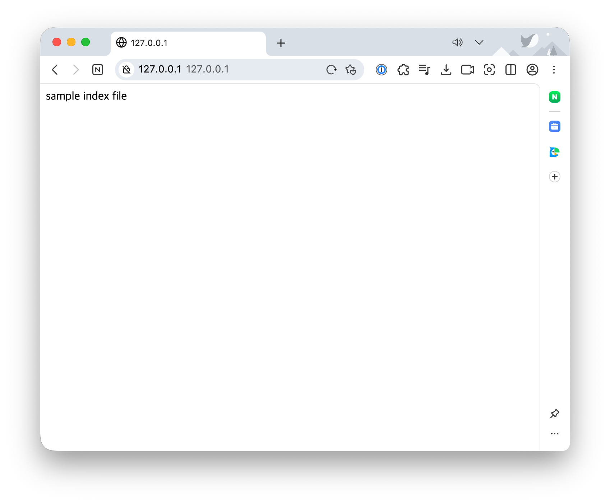

```bash
sangwoo@sangwoo-MacBookAir app % curl http://127.0.0.1:80
sample index file
```

---

## 11. 바인드 마운트 및 Docker 볼륨

### 11-1. 바인드 마운트 (Bind Mount)

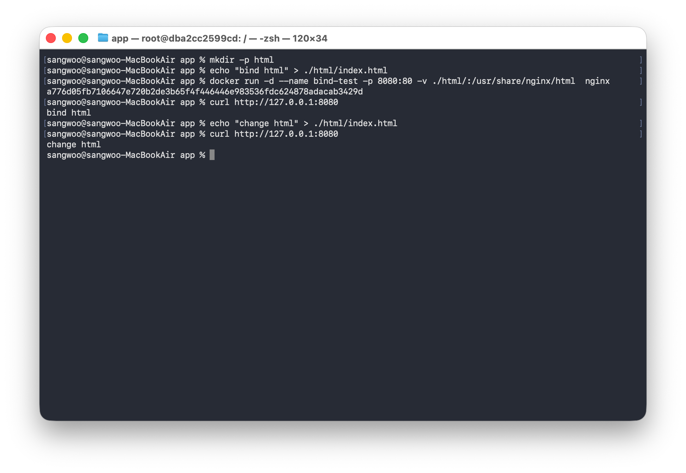

호스트의 디렉터리를 컨테이너 내부에 직접 연결한다.
호스트에서 파일을 수정하면 컨테이너에 **즉시 반영**된다.

```bash
# 호스트에 HTML 파일 준비
sangwoo@sangwoo-MacBookAir app % mkdir -p html
sangwoo@sangwoo-MacBookAir app % echo "bind html" > ./html/index.html

# 바인드 마운트로 컨테이너 실행
sangwoo@sangwoo-MacBookAir app % docker run -d --name bind-test -p 8080:80 -v ./html/:/usr/share/nginx/html  nginx
a776d05fb7106647e720b2de3b65f4f446446e983536fdc624878adacab3429d

# 변경 전 확인
sangwoo@sangwoo-MacBookAir app % curl http://127.0.0.1:8080
bind html
# 파일 수정
sangwoo@sangwoo-MacBookAir app % echo "change html" > ./html/index.html 
# 변경 후 확인 (즉시 반영됨)
sangwoo@sangwoo-MacBookAir app % curl http://127.0.0.1:8080            
change html
```

> 바인드 마운트는 개발 중 코드 수정을 즉시 확인할 때 유용하다.

### 11-2. Docker 볼륨 (Volume) - 영속성 검증

Docker 볼륨은 Docker가 관리하는 저장 영역으로, 컨테이너가 삭제되어도 데이터가 유지된다.

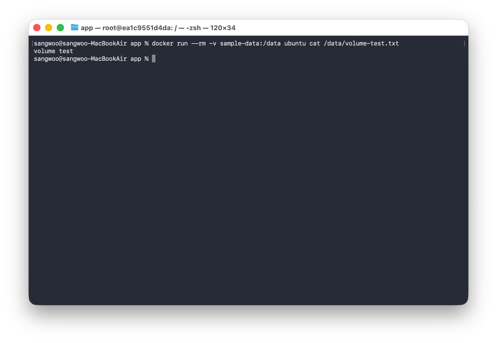

```bash
# 볼륨 생성
sangwoo@sangwoo-MacBookAir app % docker volume create sample-data
sample-data
# 컨테이너 실행 + 볼륨 연결
sangwoo@sangwoo-MacBookAir app % docker run -it --name volume-test -v sample-data:/data ubuntu /bin/bash
# 데이터 기록
root@ea1c9551d4da:/# echo "volume test" > /data/volume-test.txt
# 데이터 확인
root@ea1c9551d4da:/# cat /data/volume-test.txt 
volume test

root@ea1c9551d4da:/# exit
exit

# 컨테이너 삭제
sangwoo@sangwoo-MacBookAir app % docker rm volume-test
volume-test

# 신규 컨테이너 생성 + 데이터 확인
sangwoo@sangwoo-MacBookAir app % docker run --rm -v sample-data:/data ubuntu cat /data/volume-test.txt
volume test
```

**결과:** 컨테이너를 삭제(`docker rm`)했음에도 볼륨에 저장한 데이터(`test.txt`)는 그대로 유지된다.

> Docker 볼륨은 데이터베이스, 로그 등 컨테이너 라이프사이클과 무관하게 보존해야 하는 데이터에 사용한다.

### 11-3. 바인드 마운트 vs Docker 볼륨 비교

| 항목 | 바인드 마운트 | Docker 볼륨 |
|------|-------------|------------|
| 경로 지정 | 호스트 절대 경로 | 볼륨 이름 |
| 관리 주체 | 사용자 직접 관리 | Docker가 관리 |
| 주요 용도 | 개발 중 코드 실시간 반영 | 데이터 영속성 (DB, 로그 등) |
| 이식성 | 호스트 경로에 의존 | 경로에 독립적 |

---

## 12. Git 설정 및 GitHub 연동

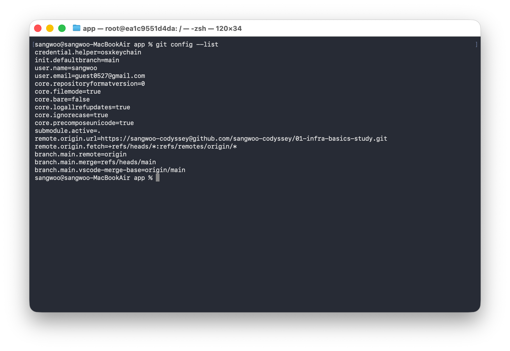

### 12-1. Git vs GitHub

| 항목 | Git | GitHub |
|------|-----|--------|
| 역할 | 로컬 버전 관리 도구 | 원격 협업 플랫폼 |
| 동작 위치 | 내 컴퓨터 | 클라우드 (웹) |
| 핵심 기능 | 커밋, 브랜치, 히스토리 관리 | PR, 이슈, 코드 리뷰, CI/CD 연동 |
| 네트워크 | 불필요 (오프라인 가능) | 필요 |

> Git은 소스코드의 변경 이력을 로컬에서 추적하는 도구이고,
> GitHub는 Git 저장소를 원격에서 호스팅하여 팀원과 공유/협업하는 플랫폼이다.

---

## 13. 트러블슈팅

### 트러블슈팅 1: 도커 컨테이너 내부 진입 실패

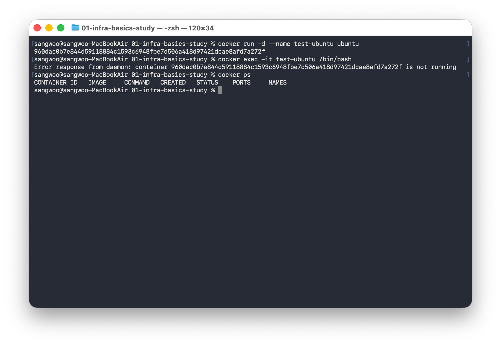

**문제:**

```bash
sangwoo@sangwoo-MacBookAir 01-infra-basics-study % docker run -d --name test-ubuntu ubuntu
960dac0b7e844d59118884c1593c6948fbe7d506a418d97421dcae8afd7a272f
sangwoo@sangwoo-MacBookAir 01-infra-basics-study % docker exec -it test-ubuntu /bin/bash
Error response from daemon: container 960dac0b7e844d59118884c1593c6948fbe7d506a418d97421dcae8afd7a272f is not running
sangwoo@sangwoo-MacBookAir 01-infra-basics-study % docker ps
CONTAINER ID   IMAGE     COMMAND   CREATED   STATUS    PORTS     NAMES
```

** 확인:**
에러 로그로 컨테이너가 현재 실행중인 아닌 상태를 확인 및 추가로 ps로 상태 확인

**해결:**
실행 명령어 변경 : docker run -it ubuntu /bin/bash


### 트러블슈팅 2: 도커 컨테이너 실행 실패

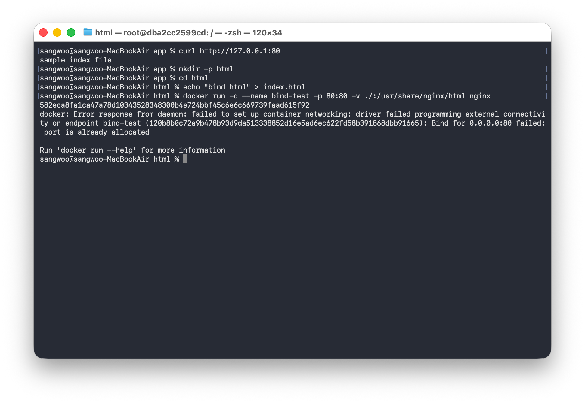

**문제:**

```bash
sangwoo@sangwoo-MacBookAir app % curl http://127.0.0.1:80
sample index file
sangwoo@sangwoo-MacBookAir app % mkdir -p html
sangwoo@sangwoo-MacBookAir app % cd html 
sangwoo@sangwoo-MacBookAir html % echo "bind html" > index.html
sangwoo@sangwoo-MacBookAir html % docker run -d --name bind-test -p 80:80 -v ./:/usr/share/nginx/html nginx
582eca8fa1ca47a78d10343528348300b4e724bbf45c6e6c669739faad615f92
docker: Error response from daemon: failed to set up container networking: driver failed programming external connectivity on endpoint bind-test (120b8b0c72a9b478b93d9da513338852d16e5ad6ec622fd58b391868dbb91665): Bind for 0.0.0.0:80 failed: port is already allocated

Run 'docker run --help' for more information
```

** 확인:**
에러 로그 확인 시 이미 80포트 사용중이므로 오류 발생

**해결:**
사용 포트 명령 80 -> 8080